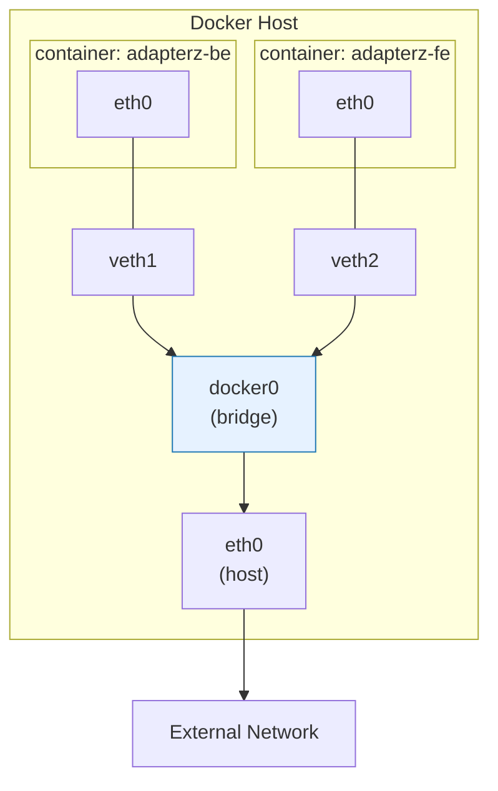

# TIL

## 날짜: 2026-07-01
## 소제목: Docker Bridge Network와 컨테이너 네트워크 이해

### 새로 배운 내용

#### 주제 1: Bridge Network란 무엇인가
- Bridge Network는 동일한 Docker Host 안의 컨테이너들이 서로 통신할 수 있도록 연결하는 Docker의 기본 가상 네트워크이다.
- 한 대의 Docker Host 내부에서 여러 컨테이너를 연결한다.
- 각 컨테이너는 IP 주소를 할당받고 Docker Bridge를 통해 다른 컨테이너 및 외부 네트워크와 통신한다.



```text
Container <-> Bridge <-> Host <-> External Network
```

#### 주제 2: 컨테이너 전용 네트워크가 필요한 이유
- 실제 서비스는 보통 하나의 프로그램이 아니라 여러 컴포넌트로 구성된다.

| 통신 주체 | 목적 |
| --- | --- |
| 사용자 -> Nginx | 웹사이트 또는 API 요청 |
| Nginx -> API | 리버스 프록시 요청 전달 |
| API -> MySQL | 데이터 조회 및 저장 |
| API -> 외부 인터넷 | 외부 API 호출, 패키지 다운로드 등 |

- 모든 컨테이너를 Host Network에 직접 연결하면 컨테이너별 포트 관리가 어려워진다.
- MySQL처럼 외부에 공개할 필요가 없는 컨테이너가 인터넷에 노출될 수 있다.
- 컨테이너는 삭제와 재생성이 자주 발생하며, 이 과정에서 IP 주소가 변경될 수 있다.
- IP를 설정에 직접 기록하면 컨테이너 재생성 후 연결이 깨질 수 있다.
- 하나의 호스트에서 여러 프로젝트를 실행하면 서로 관계없는 컨테이너가 의도치 않게 통신할 수 있다.

```text
Memo App
- MySQL
- Redis
- Node.js

Portainer
```

- Portainer는 Memo App의 MySQL이나 Redis에 접근할 이유가 없다.
- 모든 컨테이너가 같은 네트워크에 들어가면 브로드캐스트를 포함한 불필요한 통신 범위가 커질 수 있다.
- Docker는 컨테이너별로 분리된 네트워크 환경을 만들고 필요한 컨테이너끼리만 같은 네트워크에 연결할 수 있도록 한다.

#### 주제 3: Docker Host
- Host는 Docker Engine이 실행되는 실제 컴퓨터 또는 서버이다.
- Linux 머신, EC2, MacBook 등이 Docker Host가 될 수 있다.

```text
EC2 Ubuntu Server = Docker Host

Docker Engine
- Nginx Container
- Spring Container
- MySQL Container
```

- Docker Host는 컨테이너를 실행하고 관리하는 기반 컴퓨터이다.
- 컨테이너들은 Host의 CPU, Memory, Network 자원을 공유하지만 가능한 한 서로 분리된 환경에서 실행된다.

#### 주제 4: 네트워크 인터페이스
- 네트워크 인터페이스는 컴퓨터나 컨테이너가 네트워크 통신을 수행하는 출입구이다.

| 구분 | 예시 | 의미 |
| --- | --- | --- |
| 물리 네트워크 인터페이스 | `eth0`, `ens5`, `enp0s3` | 실제 서버가 VPC, 인터넷, 사내망과 연결되는 출입구 |
| 가상 네트워크 인터페이스 | 컨테이너 내부의 `eth0` | 컨테이너가 네트워크를 사용하는 출입구 |
| Docker Bridge 인터페이스 | `docker0`, `br-...` | 여러 컨테이너의 가상 인터페이스를 연결하는 가상 스위치 |

[이미지 위치: 물리 및 가상 네트워크 인터페이스]

#### 주제 5: 컨테이너의 독립적인 네트워크 공간
- Bridge Network에 연결된 컨테이너는 자신의 네트워크 공간을 가진다.
- 각 컨테이너는 다음 네트워크 정보를 가진다.

```text
- 네트워크 인터페이스
- IP 주소
- 기본 게이트웨이
- 라우팅 테이블
- DNS 설정
```

- 같은 Bridge Network에 연결된 컨테이너는 해당 네트워크의 서브넷 범위 안에서 IP를 자동으로 할당받는다.

```text
Nginx 컨테이너
└── eth0: 172.18.0.2

API 컨테이너
└── eth0: 172.18.0.3

MySQL 컨테이너
└── eth0: 172.18.0.4
```

- 각 네트워크에는 Subnet과 기본 Gateway가 설정된다.
- 컨테이너가 삭제되고 새로 생성되면 IP가 바뀔 수 있다.

#### 주제 6: Bridge Network의 내부 구조
- Bridge Network는 실제 물리 네트워크 장비가 아니라 Linux와 Docker 소프트웨어가 만드는 가상 네트워크이다.

| 구성 요소 | 역할 | 비유 |
| --- | --- | --- |
| 컨테이너 `eth0` | 컨테이너 내부 네트워크 출입구 | 각 집의 현관문 |
| veth pair | 컨테이너와 Host를 연결하는 가상 케이블 | 집과 단지를 연결하는 케이블 |
| Docker Bridge | 같은 네트워크의 컨테이너를 연결하는 가상 스위치 | 아파트 단지 내부 스위치 |
| Host NIC | Host가 외부 네트워크와 통신하는 실제 인터페이스 | 단지 밖으로 나가는 출입구 |

[이미지 위치: 컨테이너 eth0, veth pair, Docker Bridge, Host NIC 구조]

- 컨테이너 내부의 `eth0`이 Host NIC에 직접 연결되는 것은 아니다.
- 컨테이너의 `eth0`과 Host 쪽 가상 인터페이스는 veth pair로 연결된다.
- Host 쪽 veth는 Docker Bridge에 연결된다.
- 외부 통신은 Host의 라우팅, NAT, 방화벽 규칙을 거쳐 실제 네트워크 인터페이스로 나간다.

#### 주제 7: 같은 Bridge Network 안에서의 통신

[이미지 위치: 동일 Bridge Network의 Nginx와 API 통신]

- 사용자 정의 Bridge Network에서는 Docker DNS가 컨테이너 이름과 IP 주소의 관계를 관리한다.
- Nginx는 API 컨테이너의 IP를 직접 알 필요 없이 컨테이너 이름으로 요청할 수 있다.

```bash
docker run -d \
  --name api \
  --network app-net \
  my-api:latest
```

```nginx
proxy_pass http://api:8080;
```

- 같은 Docker Network 내부의 컨테이너끼리 통신할 때는 `-p` 옵션으로 Host 포트를 공개할 필요가 없다.
- `-p 8080:80`은 Host의 포트와 컨테이너 포트를 연결해 Host 또는 외부에서 접근할 수 있게 할 때 사용한다.

```text
Nginx -> api:8080 가능
다른 동일 네트워크 컨테이너 -> api:8080 가능
Host -> api:8080 직접 접근 불가
외부 사용자 -> api:8080 직접 접근 불가
```

> Host 또는 외부에서 API 컨테이너에 직접 접근하려면 해당 포트를 별도로 Publish해야 한다.

#### 주제 8: 기본 Bridge와 사용자 정의 Bridge
- Docker를 설치하면 `bridge`라는 기본 네트워크가 자동으로 생성된다.

```bash
docker network ls
```

- 컨테이너 실행 시 `--network` 옵션을 지정하지 않으면 기본 Bridge에 연결된다.
- 실무에서는 컨테이너 이름 DNS와 프로젝트별 네트워크 격리를 지원하는 사용자 정의 Bridge를 주로 사용한다.

| 비교 항목 | 기본 `bridge` 네트워크 | 사용자 정의 Bridge Network |
| --- | --- | --- |
| 생성 방식 | Docker 설치 시 자동 생성 | `docker network create`로 생성 |
| 컨테이너 이름 DNS | 기본적으로 지원하지 않음 | 지원 |
| 네트워크 분리 | 기본 컨테이너들이 같은 네트워크에 연결될 수 있음 | 필요한 서비스끼리만 묶을 수 있음 |
| 실행 중 연결 및 해제 | 제한적 | `docker network connect`, `disconnect` 가능 |
| 실무 권장도 | 단순 테스트용 | 서비스 단위 구성에 권장 |

#### 주제 9: Docker Network 명령어

##### 네트워크 생성과 확인

```bash
# Bridge Network 생성
docker network create app-net

# Driver를 명시해 생성
docker network create --driver bridge app-net

# 네트워크 목록 확인
docker network ls

# 네트워크 상세 정보 확인
docker network inspect app-net
```

| 항목 | 의미 |
| --- | --- |
| `Driver` | 네트워크 Driver 종류 |
| `Subnet` | 컨테이너에 할당할 IP 범위 |
| `Gateway` | 컨테이너의 기본 Gateway |
| `Containers` | 연결된 컨테이너 목록 |
| `IPv4Address` | 각 컨테이너에 할당된 IP |

##### 실행 중인 컨테이너 연결 및 해제

```bash
docker network connect app-net nginx-3
docker network disconnect app-net nginx-3
```

#### 주제 10: Network Segmentation
- Network Segmentation은 서비스의 역할에 따라 통신 가능한 네트워크 범위를 분리하는 방식이다.

[이미지 위치: Nginx, API, MySQL Network Segmentation]

- API 컨테이너를 두 개의 네트워크에 연결할 수 있다.
- Nginx와 API는 Front Network에서 통신한다.
- API와 MySQL은 Back Network에서 통신한다.
- Nginx와 MySQL은 같은 네트워크에 연결하지 않아 직접 통신하지 못하게 한다.

```text
Nginx <-> API
API <-> MySQL
Nginx <-X-> MySQL
```

- 필요한 주체끼리만 연결하여 불필요한 접근 가능성을 줄일 수 있다.

#### 주제 11: Sidecar Pattern
- Sidecar Pattern은 메인 컨테이너 옆에 보조 컨테이너를 함께 두는 방식이다.
- 로그, 모니터링, 프록시, 보안, 포매팅 같은 공통 관심사를 메인 애플리케이션에서 분리할 수 있다.

[이미지 위치: Sidecar Pattern]

#### 주제 12: Worker Pattern
- Worker Pattern은 사용자 요청에서 무거운 작업을 분리하여 비동기로 처리하는 방식이다.
- API, 메시지 브로커, Worker를 역할에 맞는 네트워크로 분리할 수 있다.

[이미지 위치: API, Message Broker, Worker Pattern]

#### 주제 13: Bridge Network 실무 사용 원칙

##### 1. 사용자 정의 Bridge를 사용한다
- 컨테이너 이름을 이용한 DNS 통신을 사용할 수 있다.
- 프로젝트별로 통신 범위를 분리할 수 있다.
- 컨테이너 IP가 바뀌어도 이름을 통해 새 IP를 찾을 수 있다.
- 실행 중인 컨테이너를 네트워크에 연결하거나 분리할 수 있다.

##### 2. 컨테이너 IP를 설정에 하드코딩하지 않는다

```properties
# 지양하는 방식
DB_HOST=172.24.0.3

# 권장하는 방식
DB_HOST=mysql
```

- 컨테이너가 삭제되거나 재생성되면 IP가 바뀔 수 있다.
- 같은 사용자 정의 Bridge Network에 연결된 컨테이너 이름을 DNS 주소로 사용한다.

#### 주제 14: Bridge Network 핵심 정리
- Bridge Network는 한 Docker Host 안에서 컨테이너를 연결하는 가상 내부 네트워크이다.

| 항목 | 내용 |
| --- | --- |
| 컨테이너 네트워크 | 각 컨테이너는 IP와 Network Interface를 가진 독립적인 환경을 사용 |
| 내부 통신 | 같은 Bridge Network의 컨테이너끼리 통신 가능 |
| 외부 공개 | 외부에 공개할 서비스만 `-p`로 Host 포트와 연결 |
| DNS | 사용자 정의 Bridge에서 컨테이너 이름으로 통신 가능 |
| 실무 권장 | 기본 Bridge보다 사용자 정의 Bridge 사용 |

---

#### 주제 15: Docker Network Driver
- Docker는 환경과 목적에 따라 여러 Network Driver를 제공한다.

##### Bridge Driver
- 한 Docker Host 안에서 컨테이너들을 가상 스위치로 연결한다.
- 단일 Host 내부의 일반적인 컨테이너 통신에 사용한다.

##### Host Driver
- 컨테이너가 별도의 네트워크 공간을 만들지 않고 Host의 네트워크 공간을 직접 공유한다.
- 컨테이너는 별도의 IP를 할당받지 않고 Host의 IP와 포트를 사용한다.

| 구분 | 내용 |
| --- | --- |
| 장점 | Bridge보다 네트워크 경로가 단순함 |
| 장점 | NAT와 Port Mapping이 필요 없음 |
| 활용 | Host에서 실행 중인 서비스에 `localhost`로 직접 접근해야 하는 경우 |
| 단점 | 컨테이너와 Host의 네트워크 격리가 사라짐 |
| 단점 | Host 또는 다른 컨테이너가 점유한 포트를 동시에 사용할 수 없음 |

- 여러 서비스가 한 서버에 공존하는 환경에서는 포트 충돌과 격리 문제로 일반적으로 사용하기 어렵다.

##### Overlay Driver
- 여러 Docker Host에 분산된 컨테이너를 하나의 가상 내부 네트워크처럼 연결한다.
- Bridge는 한 Host 안에서만 동작하지만 Overlay는 여러 Host 사이를 연결한다.

```text
EC2 한 대 내부의 Nginx <-> API <-> MySQL
-> Bridge Network

여러 EC2에 분산된 컨테이너 간 통신
-> Overlay Network
```

- 여러 EC2에 분산된 서비스 컨테이너를 연결할 수 있다.
- 컨테이너가 다른 Host로 이동해도 같은 Overlay Network를 사용하면 통신할 수 있다.
- Docker 환경에서는 일반적으로 Docker Swarm 구성이 필요하며 관련 노드 간 통신 설정도 필요하다.

##### Macvlan Driver
- 컨테이너마다 별도의 MAC 주소를 부여하여 물리 네트워크에 직접 연결된 장치처럼 보이게 한다.
- Bridge Network에서는 외부 네트워크가 컨테이너를 독립된 물리 장치처럼 직접 보지 못한다.
- Macvlan은 컨테이너를 물리 네트워크의 별도 장치처럼 보여야 하는 레거시 애플리케이션이나 물리 장비 연동 환경에서 사용할 수 있다.
- 일반적인 현대 웹 서비스에서는 사용 빈도가 높지 않다.

#### 주제 16: Network Driver 비교

| Driver | 통신 범위 | 네트워크 격리 | 대표 사용처 |
| --- | --- | --- | --- |
| Bridge | 단일 Docker Host | 컨테이너별 네트워크 공간 제공 | 일반적인 단일 서버 컨테이너 구성 |
| Host | Host Network 직접 공유 | 낮음 | NAT 없이 Host Network를 직접 사용해야 하는 특수 환경 |
| Overlay | 여러 Docker Host | 분산 Host 간 가상 네트워크 | Docker Swarm의 분산 서비스 |
| Macvlan | 물리 네트워크 | 컨테이너별 MAC 주소 | 레거시 시스템 및 물리 네트워크 직접 연동 |

### 오늘의 회고
- 오늘은 컨테이너가 단순히 Host의 네트워크를 함께 사용하는 것이 아니라 독립된 네트워크 공간과 인터페이스를 가진다는 점을 배웠다.
- 개인 프로젝트에서 컨테이니끼리 통신할 경우가 많이 없을 것 같아서 활용방안을 좀 고민해보거나, 추후에 활용하는 쪽으로 해야할 것 같다. 
- 그래도 팀 프로젝트나 프로덕트 규모에 따라서 필요한 상황이 충분히 생길 것 같아서 확실히 알아둬야 할 것 같다. 
